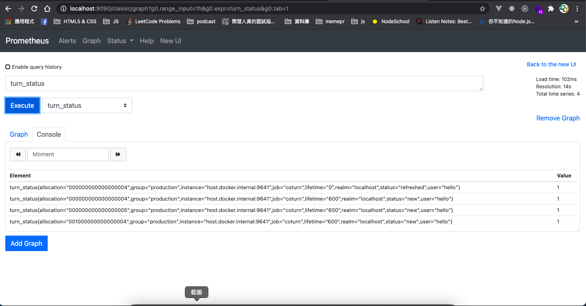
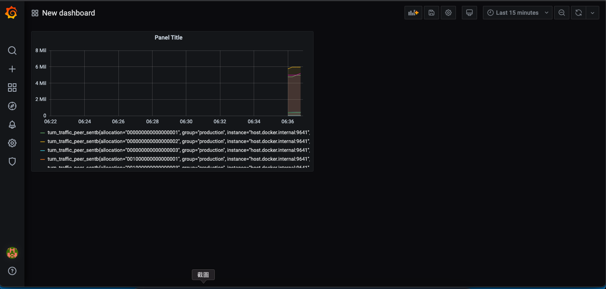

# Running Coturn + Promethes + Grafana in Docker  
## Steps
1. Build coturn image and container
```
$ cd ./coturn
$ docker build --tag self-coturn:0.1 .
$ docker run -it -P  -p 9641:9641 -p 3478:3478 -p 3478:3478/udp self-coturn:0.1
```
2. Build prometheus and container
```
$ cd ./prometheus
$ docker build --tag self-prometheus:0.1 .
$ docker run -it -P  -p 9090:9090  self-prometheus:0.1
```
You could check whether the `http:localhost:9090` is running.  
Try the webrtc local connection to produce some coturn metrics and check whether there is any coturn related metrics such as `turn_status`

3. start grafana container
```
$ docker run -d --name=grafana -p 3000:3000 grafana/grafana
```
4. Login grafana console, add prometheus as data source. Don't forget to use `http://host.docker.internal:9090` as URL.  


Still working on docker compose.