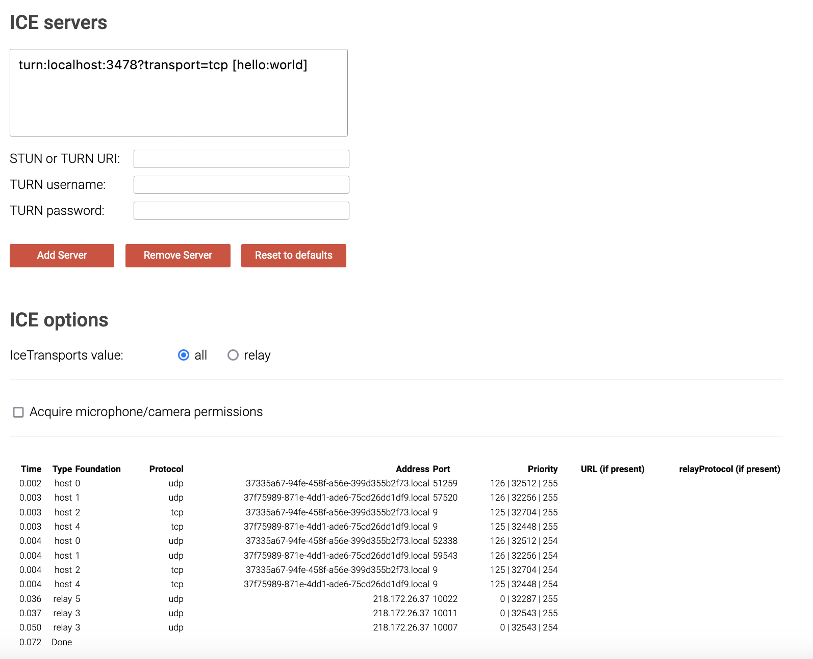
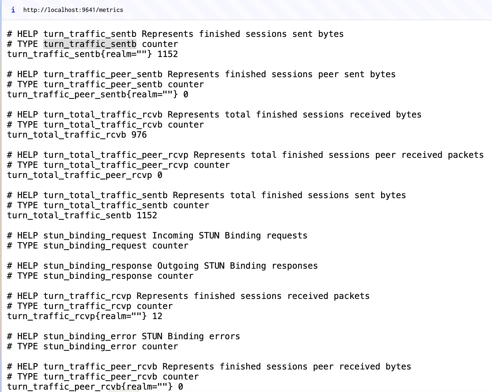
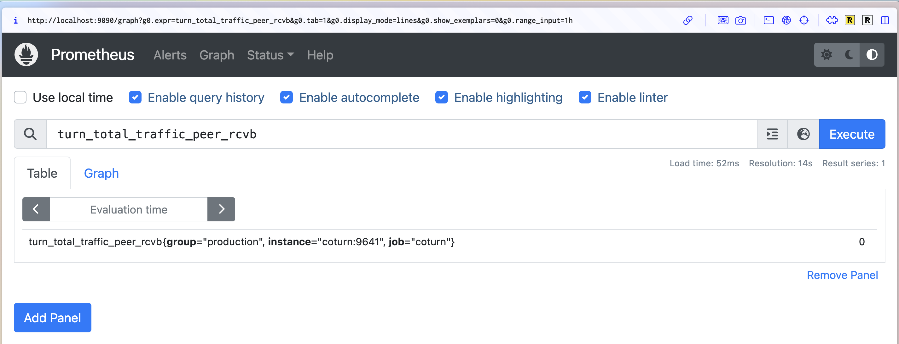

# Running Coturn + Promethes + Grafana in Docker  
1. Run `$ docker compose up` to start services.

2. Test CoTurn connection.   
Use Firefox, go to https://webrtc.github.io/samples/src/content/peerconnection/trickle-ice/.  
Type in
- STUN or TURN URI: `turn:localhost:3478?transport=tcp`
- username: `hello`
- password: `world`

> Note: Chrome has some [connection issue (error code 701)](https://github.com/coturn/coturn/issues/678#issuecomment-1442674634). 

3. Check Prometheus statistics.  
Go to http://localhost:9641/metrics. This pages shows the metrics of CoTurn server.  

It will export to Prometheus. Go to http://localhost:9090/graph and type in metrics in the previous link such as `turn_traffic_sentb`.
